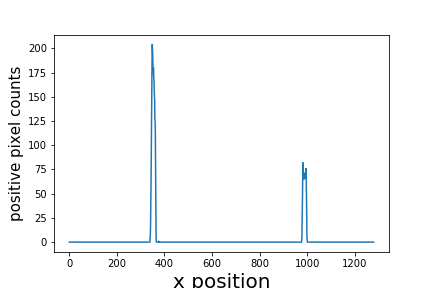
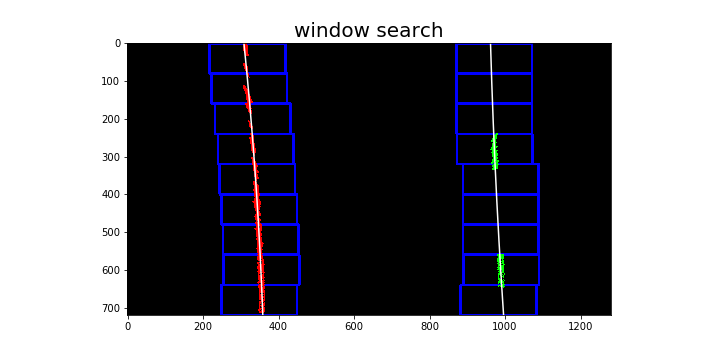
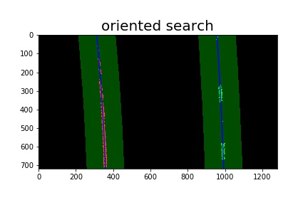
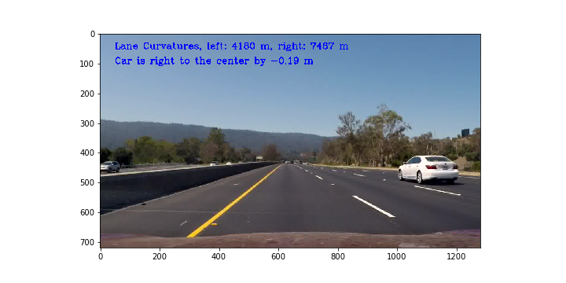
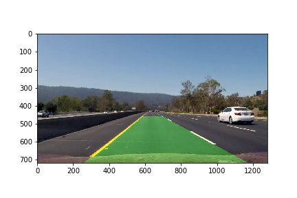

## Writeup Template

### You can use this file as a template for your writeup if you want to submit it as a markdown file, but feel free to use some other method and submit a pdf if you prefer.

---

**Advanced Lane Finding Project**

The goals / steps of this project are the following:

* Compute the camera calibration matrix and distortion coefficients given a set of chessboard images.
* Apply a distortion correction to raw images.
* Use color transforms, gradients, etc., to create a thresholded binary image.
* Apply a perspective transform to rectify binary image ("birds-eye view").
* Detect lane pixels and fit to find the lane boundary.
* Determine the curvature of the lane and vehicle position with respect to center.
* Warp the detected lane boundaries back onto the original image.
* Output visual display of the lane boundaries and numerical estimation of lane curvature and vehicle position.

[//]: # (Image References)

[image1]: ./output_images/undistort.png "Undistorted"
[image2]: ./output_images/undistorted_example.png "Road Transformed"
[image3]: ./output_images/red_binary.png "Binary Example"
[image4]: ./output_images/warp_image.jpg "Warp Example"
[image5]: ./examples/color_fit_lines.jpg "Fit Visual"
[image6]: ./examples/example_output.jpg "Output"
[video1]: ./project_video.mp4 "Video"


### Writeup / README


### Camera Calibration

#### 1. Briefly state how you computed the camera matrix and distortion coefficients. Provide an example of a distortion corrected calibration image.

The code for this step is in the second section of the IPython notebook.

The key is get objpoints-imgpoints pairs. The object points is the ground truth. For chessboard, these ordered 3D points can be easily created by 

```python
objp = np.zeros((9*6,3), np.float32)
objp[:,:2] = np.mgrid[0:9, 0:6].T.reshape(-1,2) 
```

The chessboard points are assumed to be fixed on the (x, y) plane at z=0, such that the object points are the same for each calibration image.  What pair with `objpoints` is  `imgpoints` , which are corners found by `cv2.findChessboardCorners(gray, (nx, ny))`.

I then used the output `objpoints` and `imgpoints` to compute the camera calibration and distortion coefficients using the `cv2.calibrateCamera()` function. 
I applied this distortion correction to the test image using the `cv2.undistort()` function and obtained this result: 

![Undistorted][image1]

### Pipeline (single images)

#### 1. Provide an example of a distortion-corrected image.

To demonstrate this step, I will demonstrate how I apply the distortion correction to one of the test images like this one:
![Undistored road image][image2]

We can see the distorted area happens around the edge, sometims it is so subtle that human eye may not notice it. 

#### 2. Describe how (and identify where in your code) you used color transforms, gradients or other methods to create a thresholded binary image.  Provide an example of a binary image result.

As show in section 2 of my notebook, I have tried different gradients and channel:

1. sobelx gray
2. sobel magnitude
3. sobel angle
4. s-channel
5. soble l-channel
6. r-channel

It turns out the red-channel is good enough to do the job. Here's an example of my output for this step.  

![red_binary][image3]

#### 3. Describe how (and identify where in your code) you performed a perspective transform and provide an example of a transformed image.

The code is right above the second part (binary image) in ipython notebook.
Perspective transform deals with the problem of depth perception. This is much important than distortion because the object farther away is less likely to be distorted. For a good perspective transform, we need to physically mark 4 points in the lanelines that form a rectangle/parallelogram and how they appear in the camera image.

```python
src = np.float32(
    [[(img_size[0] / 2) - 55, img_size[1] / 2 + 100],
    [((img_size[0] / 6) - 10), img_size[1]],
    [(img_size[0] * 5 / 6) + 60, img_size[1]],
    [(img_size[0] / 2 + 55), img_size[1] / 2 + 100]])
dst = np.float32(
    [[(img_size[0] / 4), 0],
    [(img_size[0] / 4), img_size[1]],
    [(img_size[0] * 3 / 4), img_size[1]],
    [(img_size[0] * 3 / 4), 0]])
```

This resulted in the following source and destination points:

| Source        | Destination   | 
|:-------------:|:-------------:| 
| 585, 460      | 320, 0        | 
| 203, 720      | 320, 720      |
| 1127, 720     | 960, 720      |
| 695, 460      | 960, 0        |

I verified that my perspective transform was working as expected by drawing the `src` and `dst` points onto a test image and its warped counterpart to verify that the lines appear parallel in the warped image.

![alt text][image4]

#### 4. Describe how (and identify where in your code) you identified lane-line pixels and fit their positions with a polynomial?


Code implementaton in the section 3 of my notebook.

First, run a histogram to estimate the lane line position as the starting points.



Then I used several windows to collect points on the lanelines. 



With these points, I am able to fit parabolic curves and use the fitting coefficients as the starting points to more precisely search in the all subsequent images.




#### 5. Describe how (and identify where in your code) you calculated the radius of curvature of the lane and the position of the vehicle with respect to center.
The code is in 3.4 part of my notebook.
For the real-world curvature, the first thing is to make a connections between the pixel value and the physcial size. The use the rescaled pixels and equation to recalculate the fitting coefficient.

The off-center value is calcuated the difference of:

1. the car position is in the middle of the camera image
2. the lane center is in the middle of two lane lines

Then use `cv2.putText()` to write these information on image.


#### 6. Provide an example image of your result plotted back down onto the road such that the lane area is identified clearly.

The code snippet is alread provided by the project instruction. The key thing is use   Minv to warp image back to the original perspecive. Here is an example of my result on a test image:




---

### Pipeline (video)

#### 1. Provide a link to your final video output.  Your pipeline should perform reasonably well on the entire project video (wobbly lines are ok but no catastrophic failures that would cause the car to drive off the road!).


Condense all the above code snippet together into a function called `pipeline`, then use the following code to produce a video:

```python
from moviepy.editor import VideoFileClip
output = 'project_output.mp4'
challenge_clip = VideoFileClip('project_video.mp4').fl_image(pipeline)
%time challenge_clip.write_videofile(output, audio=False)
```
Here's a [link to my video result](./project_output.mp4)

---

### Discussion

#### 1. Briefly discuss any problems / issues you faced in your implementation of this project.  Where will your pipeline likely fail?  What could you do to make it more robust?

I know my model is not robust enough because I only use red-channel, which is somewhat sensitive to lightness.  To imporve the robustness, I will combine with other channels like s-channel and sobelx. And other paraterms such as margin, mask size may be also tuned. 

Actually, the most difficut thing is find the intial lane line centers, which may require a lot of manual exploration.
