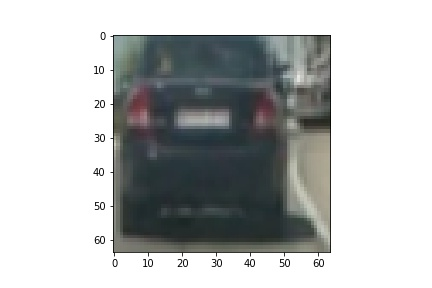
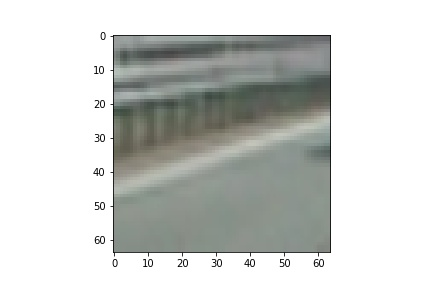
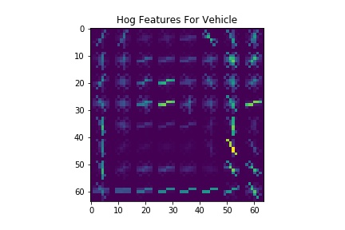
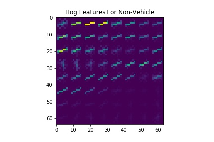
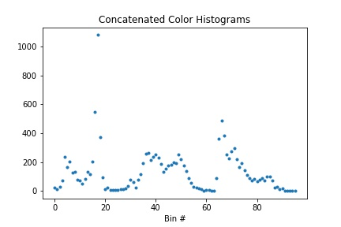
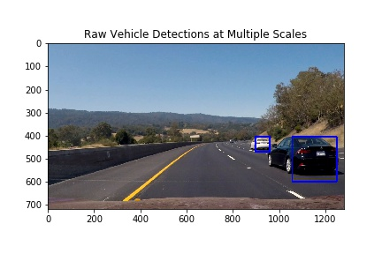
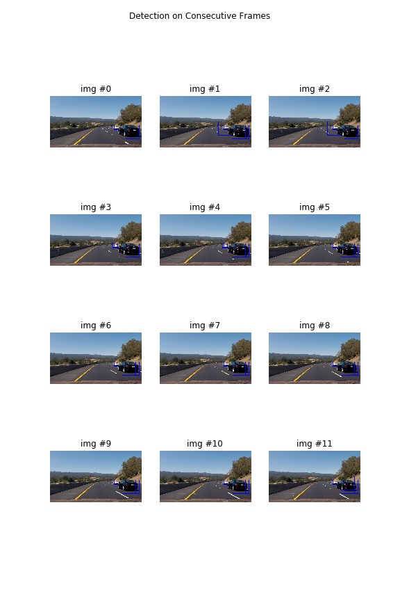
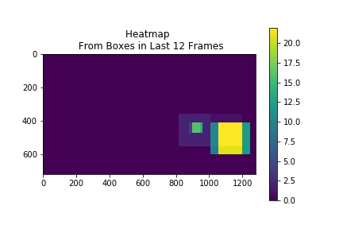
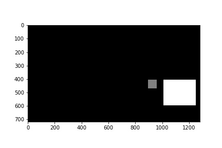
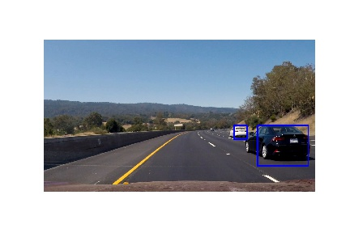

##Writeup Template
###You can use this file as a template for your writeup if you want to submit it as a markdown file, but feel free to use some other method and submit a pdf if you prefer.

---

**Vehicle Detection Project**

The goals / steps of this project are the following:

* Perform a Histogram of Oriented Gradients (HOG) feature extraction on a labeled training set of images and train a classifier Linear SVM classifier
* Optionally, you can also apply a color transform and append binned color features, as well as histograms of color, to your HOG feature vector. 
* Note: for those first two steps don't forget to normalize your features and randomize a selection for training and testing.
* Implement a sliding-window technique and use your trained classifier to search for vehicles in images.
* Run your pipeline on a video stream (start with the test_video.mp4 and later implement on full project_video.mp4) and create a heat map of recurring detections frame by frame to reject outliers and follow detected vehicles.
* Estimate a bounding box for vehicles detected.

###Histogram of Oriented Gradients (HOG)

####1. Explain how (and identify where in your code) you extracted HOG features from the training images.

The code for this step is contained in the second code cell of the IPython notebook 

I started by reading in all the `vehicle` and `non-vehicle` images.  Here is an example of one of each of the `vehicle` and `non-vehicle` classes:




I then explored different color spaces and different `skimage.hog()` parameters (`orientations`, `pixels_per_cell`, and `cells_per_block`).  I grabbed random images from each of the two classes and displayed them to get a feel for what the `skimage.hog()` output looks like.

Here is an example using the `YCrCb` color space and HOG parameters of `orientations=8`, `pixels_per_cell=(8, 8)` and `cells_per_block=(2, 2)`:




I also added to the hog features some binned color values, after converting from RGB to HSV space. After settling on 32 bins per channel (96 total bins), I looked at the color histogram:




####2. Explain how you settled on your final choice of HOG parameters.

I tried various combinations of parameters by inspecing the test images, short video, and occasionally the longer project video.

```num_orientations = 9```

Here, I stuck with the class lecture recommendation that increasing number of orientations would not likely give better performance.

```pix_per_cell = 8```

I tried a few values, but a lower number seemed to not give good histograms while higher numbers gave too few features since the input image is only 64x64. If it had been 128x128 or 264x264 maybe we could have higher values.

```cell_per_block = 4```

I stuck with this recommendation from class. Also, with the pix_per_cell and only a 64x64 image, this cannot be much bigger.


####3. Describe how (and identify where in your code) you trained a classifier using your selected HOG features (and color features if you used them).

code cell 21 is to train the svm model. 
I loaded the GTI and KITTI extracted data for vehicles and the GTI and "extras" data for non vehicles. Along with the SVM and color features, this gave me the following matrix shapes:

    Vehicle array: 8792 rows, 3696 columns
    Non-Vehicle array: 8968 rows, 3696 columns

I then split non-randomly into train and test sets to make sure the train and test sets are not too similar to each other.I get the following matrix shapes:

    Training set shape (14208, 3696)
    Testing set shape (3552, 3696)
    Training mean 0.50
    
I then used the training data to establish scaling using from sklearn.preprocessing.StandardScaler, then train a Support Vector Machine Classifier using sklearn svm:

```
clf = svm.SVC(C=0.5,kernel='rbf', gamma='auto',verbose=True,probability=True)
```

This resulted in the following results:
Train Accuracy of SVC =  0.994017454955
Test Accuracy of SVC =  0.98902027027

_the code is at the Train and Evaluate SCV section of the ipynb_


As a comparision, I aslo play around with using lenet with raw images as input. It turns out lenet model is doing pretty well with 0.984 accuracy. 

###Sliding Window Search

I first define a function that implements a sliding window search at one scale (with scale being an argument to the function).

_the code is in the function find\_cars\_one\_scale_

The call signature is:

```
def find_cars_one_scale(img,scale,stride_frac = 0.5,fraction_down_image = 0.5,draw_grid=False)
```
    
img: The input image array. If integer, it is converted to float and scaled to 0-1
  
scale: Scale of the search box. Typical values are 1,2,3. A value of 1 corresponds to a 64 x 64 pixel box and 2 is a 128x128 box. I originally included the scale of 4, but after some trial and error it gave too many false positives.
    
stride_frac: The stride of the window as a fraction of a box. I used 0.5 initially, hoping that any missed vehicles at the smaller scalers would be compensated by the larger scales. After trial and error  I modified to 0.25 for the final video and got better performance. I left the default as 0.5 since the smaller stride makes procssing time slow, so a future user should start with 0.5. 
    
fraction\_down\_image: Since vehicles will not be found in the sky, I define the highest row which I will use to search for pictures. By eyeballing some images, I choose a value around half way down the image. 
    
draw_grid: Turn this to True so see all locations where a search was attempted (the grid).

Here is the original image that was used to try searching at one scale:


and the output:



---

### Video Implementation

After this, we work to reduce false positives and smoothen detection by combining detections across multiple frames. I chose to save the last 12 frames since I found the project video is about 25 frames per second so this is around half a second.  First, we see how our one_scale detector works in 12 consecutive frames:



We see good detection of vehicles with a stubborn false positive right infront of the vehicle. This would be catastrophic since it implies the car should immediately brake hard. Luckily it is only present in a few frames.

Next, we apply the heatmap technique discussed in class. For box, for every pixel inside that box, we add 1 to the heatmap. This results in:



Using the colorbar and some trial and error, a threshold value of 6 was chosen.

_the code for this is in function add\_heat_

Applying the threshold and using scipy.ndimage.measurements.label, the following boxes were produced:



which were then overlayed on the original image to get:



I also did an additional stabilitization step using the same heatmap scheme where I save the final boxes for the last 12 frames and require a threshold of 6, meaning I display the overlaps of boxes that were present in at least the last 6 frames. I was hoping this would make the boxes more stable, but it did not seem to work as well as I hoped.

With all the cells used for tuning parameters, the video workflow is summarized in the function process_image(img). 

[Video Link Here](./project_output.mp4)

---

###Discussion

####1. Briefly discuss any problems / issues you faced in your implementation of this project.  Where will your pipeline likely fail?  What could you do to make it more robust?

There was a lot of trial and error in this project to get the right parameters. I focused more on the window search aspect since the classifier was reporting 98% accuracy on a 50-50 balanced dataset. From all this tuning, the pipeline would likely fail on new videos. 
 
To make it smoother, I should track the final boxes accross frames and display an average box rather than a heatmap (I did two heatmaps, one for the raw boxes at different scales, and another for the final boxes). This would also help in the times when two vehicles are marked as one. To increase processing speed (took 3 hours to process the video, 1 hour if parameters are relaxd) I would track vehicles and only search where vehicles were prevously found or not search every frame. To improve robustness, I would try and train on more data and use the current false positives and highly weighted negatives. I could also include some (possibly local) lighting normalizations to account for different white balances since I am using color histograms in the model. Or maybe try and not have color histograms at all. Also, with some careful calibration, we could eliminate rectangles with an unlikely shape given its location in the frame. We could also have a post-processing step where we take a bounding box and try to make it tighter by doing additional analysis of pixels within the box.
### Data
Here are links to the labeled data for [vehicle](https://s3.amazonaws.com/udacity-sdc/Vehicle_Tracking/vehicles.zip) and [non-vehicle](https://s3.amazonaws.com/udacity-sdc/Vehicle_Tracking/non-vehicles.zip) examples to train your classifier.  These example images come from a combination of the [GTI vehicle image database](http://www.gti.ssr.upm.es/data/Vehicle_database.html), the [KITTI vision benchmark suite](http://www.cvlibs.net/datasets/kitti/), and examples extracted from the project video itself.   You are welcome and encouraged to take advantage of the recently released [Udacity labeled dataset](https://github.com/udacity/self-driving-car/tree/master/annotations) to augment your training data.  


